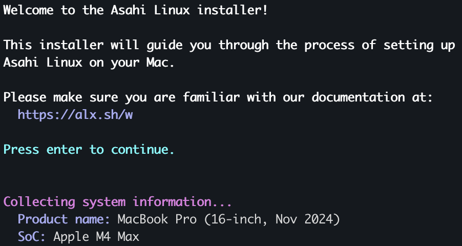
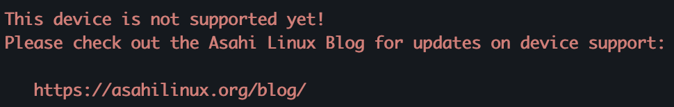

## dual boot with asahi linux on my mac m4 (aka computer #2)


<br>

i've already got a nice 200 GB partition for it:

<br>

| volume                      | purpose                                             | size      |
|-----------------------------|-----------------------------------------------------|-----------|
| apfs stub                   | boot process                                        | 3 GB      |
| efi system partition (esp)  | stage-2 bootloaders (u-boot, good 'n' old grub...)  | 500 MB    |
| Linux root (ext4)           | linux OS, kernel, user files, applications          | remaining |

<br>

today we run again:

<br>

```
curl https://alx.sh | sh
```

<br>

<p align="center">

</p>

<br>

unfortunately, [today is not the day yet](https://asahilinux.org/docs/platform/feature-support/m4/?utm_source=chatgpt.com)...

<br>

<p align="center">

</p>

<br>

we shall be back later then 🤷🏻
